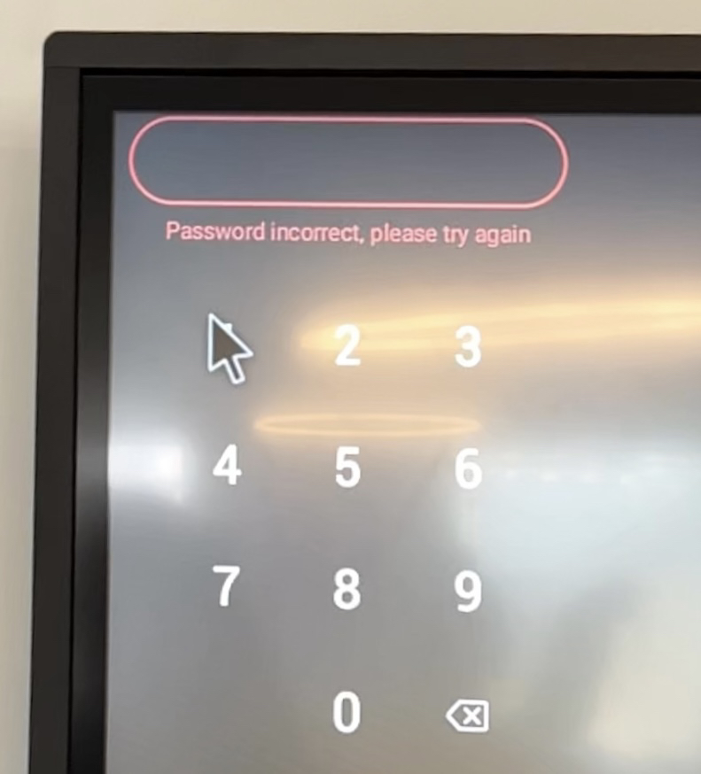

<p align="center">
    
</p>

<h1 align="center">Ducky Pin Brute Force</h1>

A Python tool that generates DuckyScript to brute-force numeric PINs using GUI automation with USB Rubber Ducky or compatible HID injection devices like a Flipper Zero.

---

## What is DuckyScript ?

[DuckyScript](https://github.com/hak5/usbrubberducky-payloads) is a simple scripting language used by devices like the **USB Rubber Ducky** to emulate a keyboard or mouse. It can inject keystrokes and mouse actions into a target computer at high speed, making it a powerful tool for automation, penetration testing, red teaming, and other cybersecurity tasks.

This project generates an interpreted DuckyScript payload that attempts all possible combinations of numeric PINs by simulating mouse movement and clicks on a graphical numpad.

Limitations I encountered (tested with a Flipper Zero):

- I couldn't use variables or loops.
- MOUSEMOVE is limited to 128px per instruction.

---

## Requirements

- Python 3.x
- A USB Rubber Ducky or any HID injection-compatible device like a Flipper Zero that supports DuckyScript.

---

## Script modes

### 1. RAM optimized (`bruteForceRAMOpti.py`)

- Writes each PIN entry to disk immediately after it's generated.
- Uses minimal memory.
- Slower due to frequent file I/O.

**Use if:** You're generating very large PIN sets (like 8-digit PINs) and have limited RAM.

### 2. CPU optimized (`bruteForceCPUOpti.py`)

- Stores the entire DuckyScript in memory, then writes everything to disk at once.
- Uses more memory but runs faster.

**Use if:** You have sufficient RAM and want to generate scripts faster.

> [!TIP]
> Don't use this mode for large PINs of 8 digits or more unless you have plenty of RAM, otherwise, the script may crash.

### Execution time comparison

> [!NOTE]
> In this test, I used a 6-digit PIN.
> The time may vary depending on your PC configuration.

| Mode | Time | Memory usage | Disk I/O frequency |
| ---- | ---- | ------------ | ------------------ |
| RAM Optimized | ~ 4m30 | Low | High |
| CPU Optimized | ~ 8s | High | Low |

---

## Generating your DuckyScript

To generate your DuckyScript payload, simply execute the script and call the `generateDuckyScript()` function with the desired parameters.

```bash
python -i ./scriptName.py
```
Then in the Python interactive shell:

```python
generateDuckyScript(pinLength, numpadGridObj, delaysTuple, outputPath, debugPinTestRange)
```

#### `pinLength`

- **Type**: Number
- **Description**: 	Number of digits in the PIN.

#### `numpadGridObj`

- **Type**: Dictionary
- **Description**: 	A dictionary mapping each digit of the numpad to its mouse coordinates.

#### `delaysTuple`

- **Type**: Tuple
- **Description**: Tuple with two delays: `(moveDelay, clickDelay)` in milliseconds.
    - moveDelay: Time between movements.
    - clickDelay: Time between clicks.

#### `outputPath`

- **Type**: String
- **Description**: 	Path where the generated DuckyScript `.txt` file will be saved.

#### `debugPinTestRange` *(Optional)*

- **Type**: Number
- **Description**:  Limit the number of PINs for testing. Useful for verifying and calibrating your script with a few PINs.
    - Example: `debugPinTestRange = 1000` will generate only the first 1000 PINs.

Example of code

```python
numpadGridObj = {
    "1": (0, 0),
    "2": (120, 0),
    "3": (240, 0),
    "4": (0, 120),
    "5": (120, 120),
    "6": (240, 120),
    "7": (0, 240),
    "8": (120, 240),
    "9": (240, 240),
    "0": (120, 360)
}

delaysTuple = (20, 50)

generateDuckyScript(4, numpadGridObj, delaysTuple, "./duckyScript.txt")
```

In this code, `numpadGridObj` represents the following numpad:



Here is also a quick preview of the brute force on a TV numpad I tried with a Flipper Zero:

*The video is played in slow motion to clearly visualize the cursor movements and clicks.*

<video width="375" src="https://github.com/user-attachments/assets/444d1531-361d-4200-8247-f8f6e400dbb3"></video>

In this demonstration, we can see the payload is brute-forcing the numeric combination from **0539** to **0543**.

---

## Legal Notice

This tool is for **educational purposes** and **authorized testing only**. Unauthorized use on systems you do not own or have explicit permission to test is illegal and unethical.

By using this software, you agree to take full responsibility for your actions.